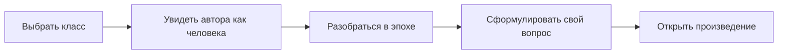

<div align="center">


# Литература.Гид школьника

**Сначала человек и эпоха. Потом — классический текст.**

Навигатор по школьной русской литературе для подростков, родителей и учителей.


</div>

## Зачем этот проект

Классическая литература часто встречает подростка фамилией автора, датой и требованием «понять главную мысль». Проект меняет порядок: сначала показывает живого человека, устройство эпохи и вопрос, который можно примерить на себя, — и только затем ведёт к произведению.

Главная продуктовая гипотеза: **если перед чтением дать короткий и проверенный контекст, подросток с большей вероятностью откроет текст и начнёт читать**.



## Что уже есть

- навигация по программе 5–11 классов;
- страницы авторов и произведений;
- исторический и культурный контекст без пересказа сюжета;
- объяснение терминов и деталей эпохи;
- ссылки на доступные полные тексты;
- редакционные правила и реестр источников;
- автоматическая проверка обязательных контентных блоков.

Первый продуктовый маршрут построен вокруг рассказа Льва Толстого **«После бала»**. Каталог постепенно расширяется на другие классы, произведения и авторов.

## Редакционные принципы

1. Не энциклопедия, а вход в текст через человека.
2. Каждый биографический факт должен помогать прочитать произведение.
3. Контекст не пересказывает книгу и не выдаёт готовую мораль.
4. Красивый факт без проверяемого источника не публикуется.
5. Главный результат — подросток открыл произведение и начал читать.

Подробнее: [редакционный стандарт](docs/research-and-editorial-standard.md), [редакционный гайд](docs/editorial-guide.md) и [принципы продукта](docs/product-principles.md).

## Запуск

Требуется актуальная версия Node.js и npm.

```bash
npm install
npm run dev
```

Откройте [http://localhost:3000](http://localhost:3000).

## Проверки

```bash
npm run validate:content
npm run typecheck
npm run build
```

## Структура

```text
app/         страницы и маршруты
components/  интерфейсные и интерактивные элементы
content/     структурированные факты, контексты и источники
docs/        продуктовые и редакционные правила
lib/         учебная программа и модели контента
scripts/     автоматическая проверка материалов
```

## Статус

Проект находится в активной разработке: расширяется каталог и продолжается редакционная проверка материалов. Ошибку, спорный источник или идею для улучшения можно описать в [Issues](https://github.com/kosbushe/literature-guide/issues).

---

Автор проекта — **Константин Буше**, учитель литературы, филолог и отец четверых детей.

